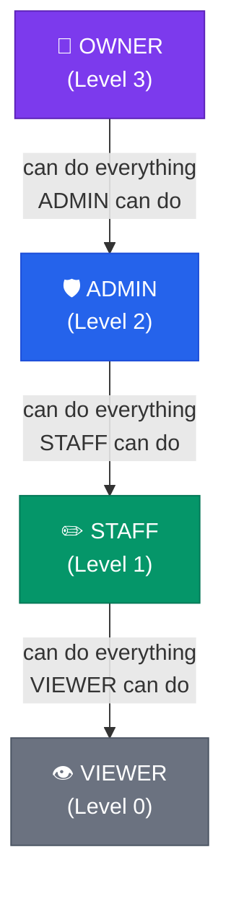
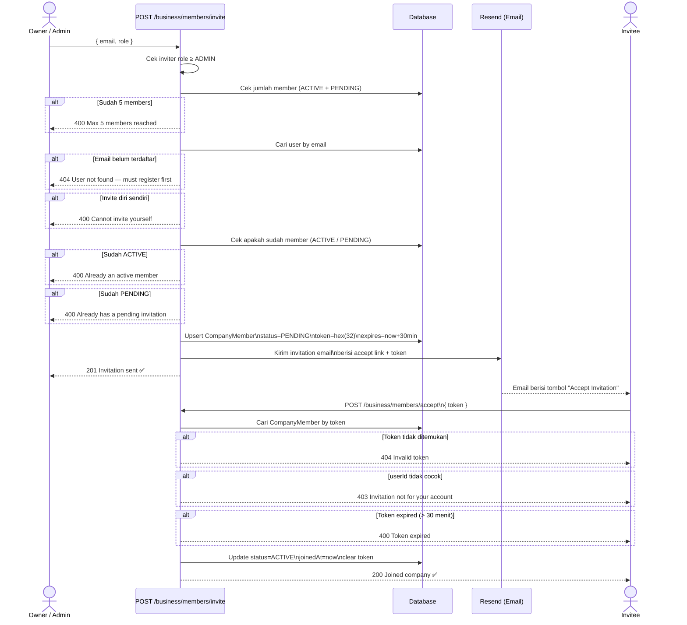
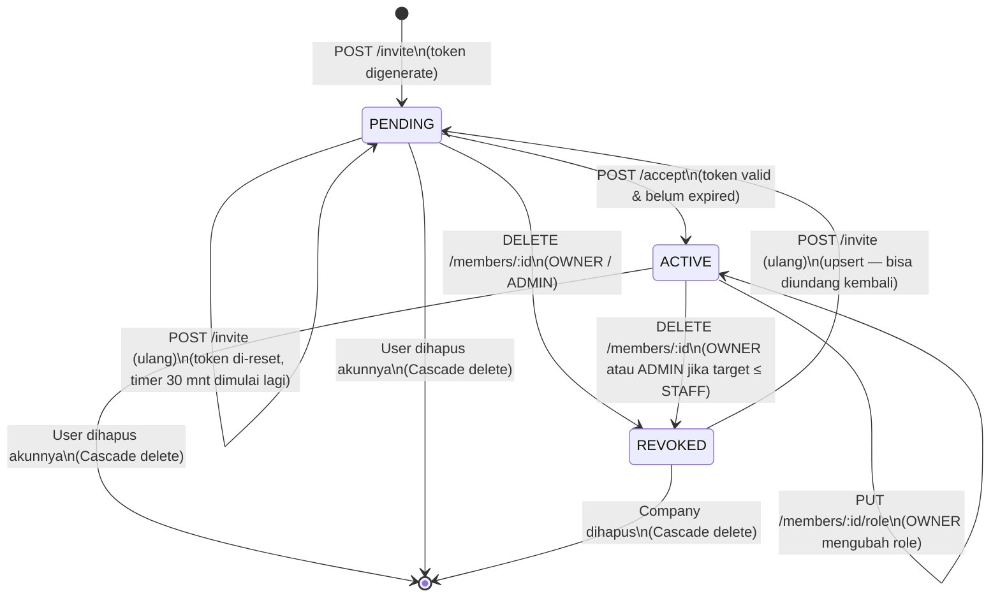
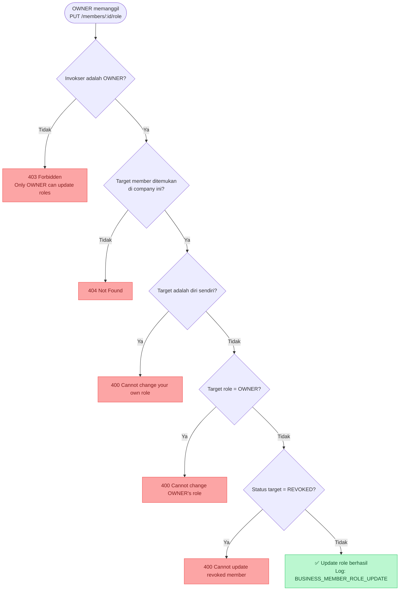
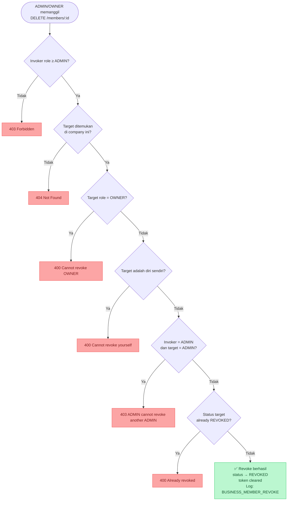

# Business Role Management — Diagram & Flowchart

> Referensi visual untuk implementasi Phase 2: Multi-user & Role Management.
> Berdasarkan `BUSINESS_MVP_PLAN.md`.

---

## 1. Hierarki Role

```
OWNER  (level 3) ──── Full access + hapus company
  │
ADMIN  (level 2) ──── Full access kecuali hapus company
  │
STAFF  (level 1) ──── Buat invoice, input transaksi
  │
VIEWER (level 0) ──── Read-only
```



---

## 2. Permission Matrix

| Aksi | OWNER | ADMIN | STAFF | VIEWER |
|------|:-----:|:-----:|:-----:|:------:|
| Lihat data company | ✅ | ✅ | ✅ | ✅ |
| Lihat list members | ✅ | ✅ | ✅ | ✅ |
| Invite member | ✅ | ✅ | ❌ | ❌ |
| Update role member | ✅ | ❌ | ❌ | ❌ |
| Revoke STAFF / VIEWER | ✅ | ✅ | ❌ | ❌ |
| Revoke ADMIN | ✅ | ❌ | ❌ | ❌ |
| Revoke OWNER | ❌ | ❌ | ❌ | ❌ |
| Update profil company | ✅ | ✅ | ❌ | ❌ |
| Hapus company | ✅ | ❌ | ❌ | ❌ |
| Buat / edit invoice | ✅ | ✅ | ✅ | ❌ |
| Input transaksi bisnis | ✅ | ✅ | ✅ | ❌ |
| Lihat laporan keuangan | ✅ | ✅ | ✅ | ✅ |
| Lihat KPI dashboard | ✅ | ✅ | ✅ | ✅ |

---

## 3. Invite Flow (End-to-End)



---

## 4. Status Lifecycle: CompanyMember



---

## 5. Update Role — Aturan & Batasan



---

## 6. Revoke Member — Aturan & Batasan



---

## 7. Batasan Kapasitas Member

```
Slot member per company: 5 (termasuk OWNER)

Contoh:
┌─────────────────────────────────────┐
│  Slot 1 │ OWNER  │ Ahmad (ACTIVE)   │
│  Slot 2 │ ADMIN  │ Budi  (ACTIVE)   │
│  Slot 3 │ STAFF  │ Cici  (ACTIVE)   │
│  Slot 4 │ VIEWER │ Deni  (PENDING)  │ ← belum accept, tetap hitung slot
│  Slot 5 │ —      │ (kosong)         │
└─────────────────────────────────────┘
  REVOKED tidak dihitung → bisa diundang ulang
```

---

## 8. Invite Token Lifecycle

```
POST /invite
    │
    ▼
Generate token = crypto.randomBytes(32).toString('hex')  → 64 char hex string
Set  expiresAt = now() + 30 minutes
    │
    ▼
Simpan ke CompanyMember.inviteToken (unique index)
    │
    ▼
Kirim email → link: {FRONTEND_URL}/business/invite/accept?token={token}
    │
    ▼
┌─────────────────────────────────────────────────┐
│  Token valid?  Cek: expiresAt > now()           │
│                Cek: member.userId == JWT user   │
│                Cek: status == PENDING           │
└─────────────────────────────────────────────────┘
    │                       │
  Valid                  Expired / Invalid
    │                       │
    ▼                       ▼
status = ACTIVE          400 / 403 / 404
joinedAt = now()
inviteToken = null        ← token di-clear setelah accept
inviteTokenExpiresAt = null
```

---

*End of Document — Phase 2 Reference — v1.0 — 2026-03-19*
